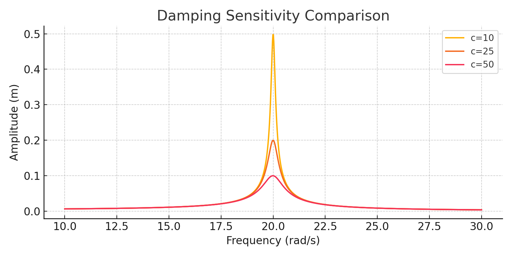
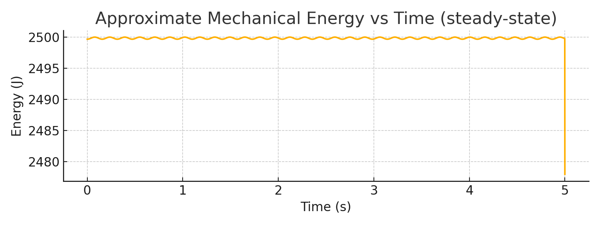
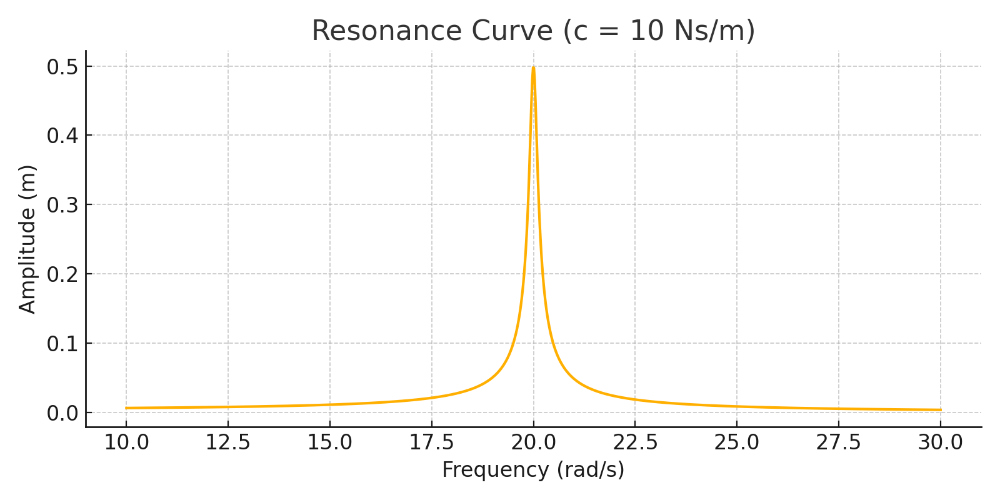
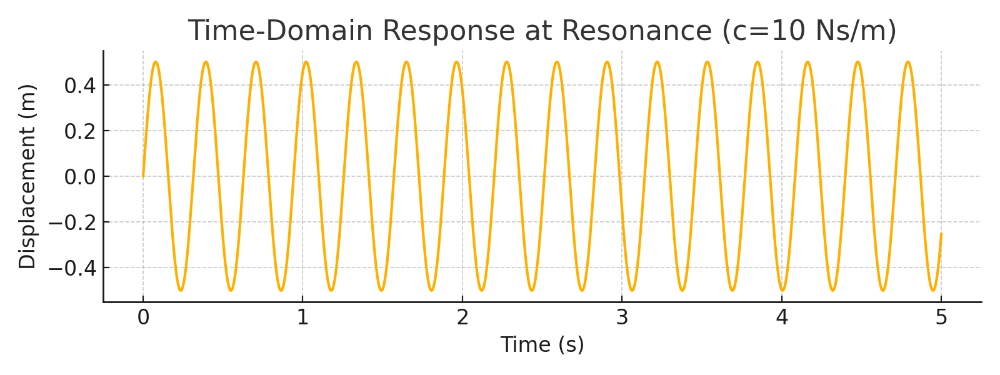

# When Tesla's Oscillator Meets Modern Science: A Computational Investigation into Mechanical Resonance ⚡🔬

An independent, 22-page computational physics investigation exploring the scientific validity of Nikola Tesla's mechanical oscillator (the historical "earthquake machine"). This project implements numerical modeling within MATLAB to simulate a forced damped harmonic system and analyze its true resonance thresholds under realistic physical parameters.

---

## 📄 Abstract Overview
This study models the mechanical constraints of Tesla's oscillator to evaluate whether the resonance amplitudes produced could reach the catastrophic structural thresholds described in historical anecdotes. By establishing computational boundaries for mass, damping coefficients, and variable driving frequencies, the simulation tracks steady-state transitions and energy dissipation loops.

The full compiled preprint document is available directly in the root directory: **`Tesla_Oscillator_JEI (1).pdf`**.

---

## 🧮 Mathematical Engine
The computational engine integrates and numerically solves the foundational second-order linear differential equation governing forced harmonic motion with damping parameters:

$$\frac{d^2x}{dt^2} + 2\gamma\frac{dx}{dt} + \omega_0^2x = \frac{F(t)}{m}$$

Where:
- $\gamma$ represents the fluid/medium damping coefficient.
- $\omega_0$ represents the natural angular frequency of the mechanical oscillator system.
- $F(t)/m$ represents the time-dependent external driving force per unit mass.

---

## 📊 Core Data Visualizations
Because the simulation scripts output high-resolution telemetry, the key analytical milestones are mapped below:

### 1. Damping Sensitivity Comparison
Analysis of how systemic friction and fluid resistance coefficients impact peak amplitude spikes.

### 2. Approximate Mechanical Energy vs. Time
Verification of the system's energy retention, accumulation profiles, and steady-state thermodynamic ceilings.

### 3. Systemic Resonance Curve (Expanded view)
Mapping the exact frequency response spectrum to locate the peak destructive window where driving frequency perfectly matches natural frequency ($\omega \approx \omega_0$).

### 4. Time-Domain Resonance Response
A continuous trace of the transient phase showing the envelope growth as the oscillator accumulates amplitude over consecutive cycles.

---

## 📁 Repository Contents
* `Tesla_Oscillator_JEI (1).pdf` - Complete 22-page typeset research paper.
* `main.tex` - Overleaf LaTeX source code containing formatting tags and structural documentation.
* `*.png` - High-fidelity graphical plots exported directly from the numerical engine execution.
